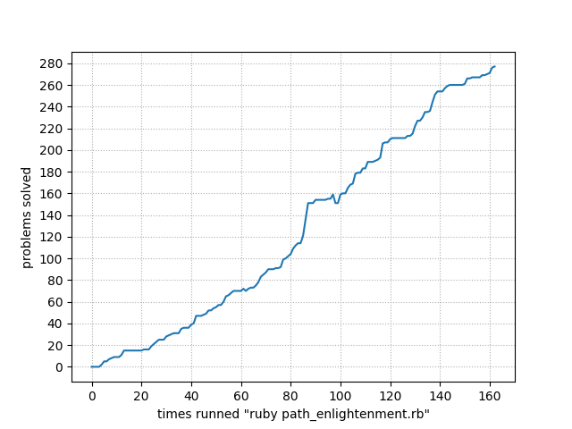

[previous]: https://github.com/dreisss/notebook-ruby

# [**_`Notebook: Ruby - Koans`_**](#notebook-ruby---koans)

Solutions to [**Ruby Koans**](https://www.rubykoans.com) dojo challenges.

- started: 01/21/23
- finished: 01/24/23

Path progress graph:

  

[**_`❰ Return to previous page`_**][previous]

