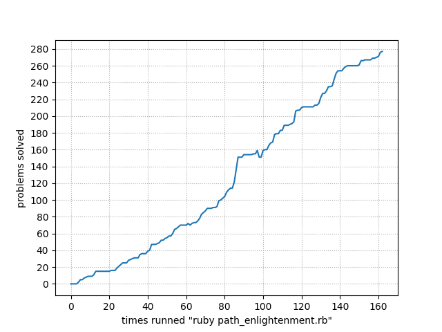

# [**_Ruby Koans_**](https://www.rubykoans.com/)

## **Learn Ruby**

### _With the Edgecase Ruby Koans_

> The Koans walk you along the path to enlightenment in order to learn Ruby. The
> goal is to learn the Ruby language, syntax, structure, and some common functions
> and libraries. We also teach you culture. Testing is not just something we pay
> lip service to, but something we live. It is essential in your quest to learn
> and do great things in the language.

 

  <a href='https://github.com/dreisss/notebook-ruby'>
    <b> << Return to main page </b>
  </a>

---

Solutions to Ruby Koans dojo challenges.

- started: 01/21/23
- finished: 01/24/23

Path progress graph:

  

